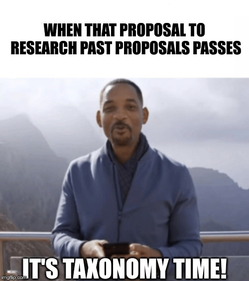

# Research on Search Engine for Proposals

## Proposal

[Original Document](https://docs.google.com/document/d/1iw7BA5aIsjuHNxi9DeZyHtatLNPw5tYYrkfNARQmVK0/edit)

### I - Objectives

1. Uncover all relevant proposals around a specific topic so that we aren’t duplicating efforts with the upcoming [proposal for research](https://docs.google.com/spreadsheets/d/1pQrfzQMafzrsXt66ZzJBTjm20qeLXoUFX51ptRywLm4/edit#gid=1194219037) \([discussion on DAOtalk](https://daotalk.org/t/case-studies-decentralized-orgs-with-on-chain-governance/395)\)
2. Propose heuristics for future attempts at “proposals archeology”
3. Be the start of a potential project for categorizing and sorting proposals semantically  

### II - Deliverables

1. Report of findings and analysis of results \(in both editable and pdf formats\)
2. Spreadsheet of findings \(interacting with [proposal tracking](https://docs.google.com/spreadsheets/d/1FV8iz4ebZb4E3nXckzPsWy7IfhtsX3filkbX_gbPLNs/edit#gid=1899049180)\)
3. Recommendations for creation of a search engine/process

## Outcomes

1. _**Key Takeaways**_
2. _\*\*\*\*_[_**Report**_](https://gendao.gitbook.io/researchwg/passed-proposals/research-on-search-engine-for-proposals/report)_\*\*\*\*_
   * _with next steps_
3. _\*\*\*\*_[_**Taxonomy**_ ](https://gendao.gitbook.io/researchwg/passed-proposals/research-on-search-engine-for-proposals/taxonomy)_\*\*\*\*_
   * _with tables of findings and mindmap_
4. _**Memes**_

### Key Takeaways

* Doing the "neck test" was a healthy exercise that should be experienced by more DAO citizens and at a lower attention cost. Developing a proposal search engine could dramatically improve coordination and overall proposal quality 
  * A well-done and beneficial retrospective/"neck-test" should yield actionable items and occur regularly. They encourage us to improve and prevent costly mistakes by prioritizing genDAOs self-evaluation.
* The current proposal repository system is inadequate for long-term record-keeping, accountability, and management. In fact, it is not a repository at all, as the proposals are not even stored in one account.
  * we believe that it should be git based, with some kind of open-source middleware \(crawlers, APIs, alternative client...\) could offer a viable candidate for solid medium-term solutions
* By analyzing the proposals using the taxonomy and the tags proposed here against a structured [vision](https://docs.google.com/document/d/10-0ppf_QpYdlBC_AFWt-QhJWyUpBRl5zU9bU1AWXUqU/edit#heading=h.ggo559linbt0) and [budget planning](https://docs.google.com/document/d/1fyhXSv_yp38FbC-R3aJPqqVJDvi6i0LATZya5F9vtZ4/edit), we may better understand the gaps and opportunities to become a more effective and cohesive group.

### Report



### Taxonomy



### Memes

