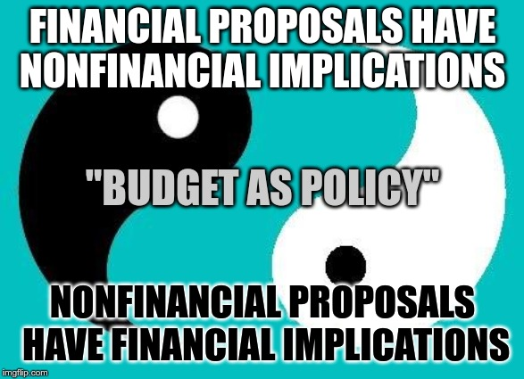

# Research on Search Engine for Proposals

## Proposal

[Original Document](https://docs.google.com/document/d/1iw7BA5aIsjuHNxi9DeZyHtatLNPw5tYYrkfNARQmVK0/edit)

### Expected Outcomes 

* Uncover all relevant proposals around a specific topic so that we aren’t duplicating efforts with the upcoming [proposal for research](https://docs.google.com/spreadsheets/d/1pQrfzQMafzrsXt66ZzJBTjm20qeLXoUFX51ptRywLm4/edit#gid=1194219037) \([discussion on DAOtalk](https://daotalk.org/t/case-studies-decentralized-orgs-with-on-chain-governance/395)\)
* Propose heuristics for future attempts at “proposals archeology”
* Be the start of a potential project for categorizing and sorting proposals semantically  

#### Deliverables:

1. Report of findings and analysis of results \(in both editable and pdf formats\)
2. Spreadsheet of findings \(interacting with [proposal tracking](https://docs.google.com/spreadsheets/d/1FV8iz4ebZb4E3nXckzPsWy7IfhtsX3filkbX_gbPLNs/edit#gid=1899049180)\)
3. Recommendations for creation of a search engine/process

## Deliveries

### Key takeaways

* The current proposal repository system is inadequate for long-term record-keeping, accountability, and management. In fact, it is not a repository at all, as the proposals are not even stored in one account.
* Unlike other DAOs, the Genesis DAO does not focus on code. In fact, it’s the only DAO that does any industry research or marketing research at all. Generally anything having to do with marketing plans is centralized—in other words planning and marketing tend to be centralized by Aragon, Zcash, DASH, and DAOstack, if at all, rather than the proposal-based DAOs they have created.
  * Regarding that we identified multiple past proposals that could have benefited from a mapping of similar initiatives 
* The proposals were fairly random, with an emphasis on marketing, particularly documentation and communications, with a few events.
* 
### **Taxonomy**

### Memes

