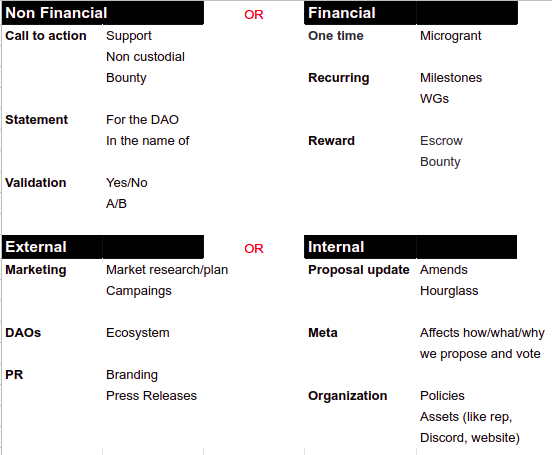

# Report

## Proposal Research

### Exploring Genesis' Past

We reviewed the past of genDAO proposals to understand what has been done so far. So we don't needlessly repeat work, and also so that we can get an idea of the realms of the work that the Collective Intelligence is funding. We also reviewed briefly the history of other DAOs \(Aragon, Dash, Zcash\) to compare what they fund against what Genesis has been funding.

By creating a taxonomy for the different areas of the DAO funding, we hope to be able to spawn the creating of better accountability tools, e.g. a search function for past proposals, or a process where we can better visualize and identify gaps and focuses. To our understanding, the first application would be to create a better repository for proposals, as well as switching from collaborating tools such as Google Docs.

The most claimant finding was the current state of the Genesis Proposals repository. It is inadequate for any kind of meaningful search or categorization. Based on this research, in the following findings, we believe that improving and building new tools around this area should be of the highest priority to the DAO.

### Key findings

1. The current proposal repository system is inadequate for long-term record-keeping, accountability, and management. In fact, it is not a repository at all, as the proposals are not even stored in one account.
   * the issue is aggravated by the simultaneous offchain \(usually gdocs\) and onchain \(Alchemy and DAOstack stack\) aspects of proposals. They have neither ease of use nor scalability at the moment. 
2. Unlike other DAOs, the Genesis DAO does not focus on code. In fact, it’s the only DAO that does any industry research or marketing research at all. Generally anything having to do with marketing plans is centralized — in other words planning and marketing tend to be centralized by Aragon, Zcash, DASH, and DAOstack, if at all, rather than by the grants-based DAOs they have created.
3. The proposals were fairly random, with an emphasis on marketing, particularly documentation and communications, with a few events.
   * By further analyzing proposals, using the taxonomy proposed here against a structured [vision](https://docs.google.com/document/d/10-0ppf_QpYdlBC_AFWt-QhJWyUpBRl5zU9bU1AWXUqU/edit#heading=h.ggo559linbt0) and [budget planning](https://docs.google.com/document/d/1fyhXSv_yp38FbC-R3aJPqqVJDvi6i0LATZya5F9vtZ4/edit), we may better understand the gaps and opportunities to become a more effective and anti-fragile organization.
4. Doing the "neck test" was a healthy exercise that should be available to more DAO citizens and at a lower attention cost. Developing a proposal search engine could dramatically improve coordination and the proposal quality.
   * A well-done and beneficial retrospective/"neck-test" should yield actionable items and occur regularly. They encourage us to improve and prevent costly mistakes by prioritizing self-evaluation.
   * We identified and marked multiple past proposals that could have benefited from a comparative analysis against past proposals and/or landscape mappings.

## **Taxonomy**

### **Basic taxonomy**

The basic taxonomy for the project divides the proposals into those who asked for money \(**financial**\) and those who asked for no money or rep only \(**non-financial**\). The second axis was the **external** versus **internal** axis, where external projects are designated as anything that isn't aimed at the DAO directly, but is designed for research, bringing in community members, etc. Internal proposals are those that affect the DAO itself, including how the proposals are made, policies, and code.

Even though this model might leave an impression of being too rigid, we would like to acknowledge that, like yin & yang:

* **Financial** proposals have nonFinancial implications according to the concept of "budget as policy";
* **nonFinancial** proposals have financial externalities like unaccounted researching, the value of proposal writing in itself, or simply external funding;
* **External** proposals have internal implications as they should leave breadcrumbs and artifacts for future efforts like opening precedents;
* **Internal** proposals have external implications as all of them are public and transparent;   

See [this meme](https://blobscdn.gitbook.com/v0/b/gitbook-28427.appspot.com/o/assets%2F-LYSSKOPUjmfbvn6hc2p%2F-Le5-EGAdSvkvOhtqVIs%2F-Le51RgxMdaZmPJzCJF-%2Fimage.png?alt=media) from the [Memes Section](https://app.gitbook.com/@gendao/s/researchwg/~/drafts/-Le4hEXmlDd01X6bUBAX/primary/passed-proposals/research-on-search-engine-for-proposals#memes).

## **Findings**

### **Taxonomy breakdown**

As shown below, most proposals were one-time proposals, and only a quarter of proposals were recurring proposals.

The following chart shows the breakdown into the meta-categories of the organization. Approximately two-thirds were internal \(63%\) versus external proposals, and in the chart below there’s a clear emphasis on Organization and Meta sections. While in some organizations, this might be construed as an excessive percentage of navel-gazing, given that the purpose of the Genesis DAO is to explore the governance of DAOs, this seems appropriate, especially given the newness of the organization. While it is natural that a lot of Genesis’ time is spent considering how to run Genesis itself, informal conversations with members of the DAO revel that it also generates a high level of frustration and a feeling that the organization is slow to work with.

Another important note is that the initial proposals are limited in nature by the current budget allocations of the DAO. While Aragon’s funding is in the hundreds of thousands or even millions, and DASH’s average proposal size is $22,00, Genesis’ monthly budget is below that, meaning that the primary participants in the DAO are skewed towards people who can either break their proposals into smaller bits, who are also salaried in some way by DAOstack, or are interested in the experiment itself. The researchers have no judgment on whether this is “good” or “bad’, just a reflection on the nature of the community making the proposals.

### **Tagging breakdown**

The proposals were read and tagged with numerous tags, depending on the type of work that was being done, the geography and the purpose of the work. The tags used were based on traditional categorization in most companies. The chart below shows an emphasis on marketing and documentation \(often one proposal includes both\). While development was a focus of several proposals, compared to the core development of other projects, and of the DAOstack core team, the amount of development on the Genesis platform is minimal, and much of it was based on improving the Alchemy backend and on interfacing to other platforms.

### Scope

We did not perform an analysis per-budget. And chose to consider only the proposals that made into the the [Proposal Tracking](https://docs.google.com/spreadsheets/d/1FV8iz4ebZb4E3nXckzPsWy7IfhtsX3filkbX_gbPLNs/edit#gid=1899049180) from the ATF and only until this very proposal passing. That excludes: rejected proposals, new member's request for rep, and the ones before the tracking started. 

## Next steps 

From our [key findings](https://app.gitbook.com/@gendao/s/researchwg/~/drafts/-Le4Tkvne7saZ5XO8Znl/primary/passed-proposals/research-on-search-engine-for-proposals/report#key-findings), we identified solution candidates and listed them below as proposal ideas \(bounties mostly\), preProposals and also as support for existing ones. It is important to note that all proposal ideas are more than open for collaboration feel free to pick them for yourself.

* Proposal/Bounty ideas: 

  * Proof of Concept for Private Voting on Alchemy¹
  * Add search functionality to [DAO-explorer](https://dao-explorer.com)
  * Analysis of funds allocated breakdown 
  * Analysis of reputation given versus actual use of REP, that is, whether people allocated REP are actually using it.

* preProposals:
  * [Monthly Retrospectives](https://docs.google.com/document/d/1mS9ORsq647xblKiAxQGdwEJ9PuJnghl-8iBkbVT_NEs/edit?usp=sharing)
  * Search engine, tagging and repository all-in-one solution candidate \(COMING SOON\) 
* Support for ongoing proposals:
  * [Creating the first set of GenDAO’s Vision/Objectives/Key Results ](https://docs.google.com/document/d/10-0ppf_QpYdlBC_AFWt-QhJWyUpBRl5zU9bU1AWXUqU/edit#heading=h.vaikfqc64l1)
  * [DAO budgeting 101](https://docs.google.com/document/d/1fyhXSv_yp38FbC-R3aJPqqVJDvi6i0LATZya5F9vtZ4/edit)
  * DAO Landscape Mapping \(COMING SOON\)

> ¹ The authors are concerned about the transparency of voting with the Alchemy Explorer. Anonymous voting allows people to worry less about the political implications of their votes and eliminates people voting for “friends” or people with more power, just to gain favor. We also acknowledge the discussion being carried [here](https://daotalk.org/t/private-voting-module/469/2?u=pat).

## References

> * \#TokenSpace by Wassim
> * Presentation "Beyond the End of History" by Cem
> * Proposal Tracking Categories by Fran from ATF
> * "No Funds? No Problem!" non financial proposals investigation by Pedro
> * Proposal "Tracks" from Aragon AGP-1
> * [EntETHalliance token taxonomy guidelines](undefined)
> * [Difference between PR and Marketing](undefined)

