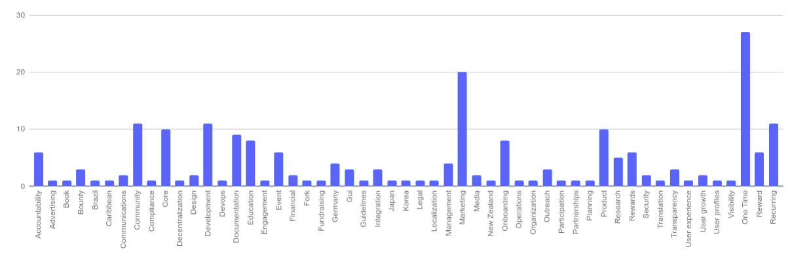
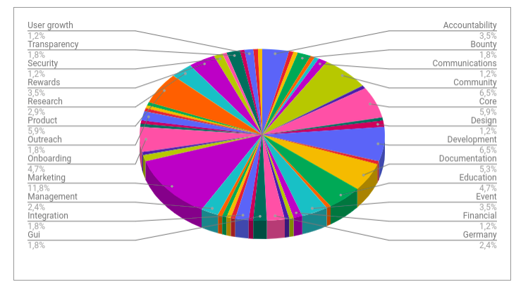

# Tagging Experiment

## Graphs

## Tagging Proposals

_Sampling: financial internal proposals from delivered ATF tracking;_

| **proposal title** | Tags |
| :--- | :--- |
| The accountability task force recurring proposal - Feb 2019 | accountability, management |
| Investigation proposal for website creation | research, community, marketing |
| DAO Explorer UI upgrades | development, core, product |
| Alchemy Identity Feature | development, core, product, integration |
| The ATF V2.1: from a taskforce to a decentralized accountability network | accountability, management |
| The Tao of the DAO | documentation, research, book, guidelines, community |
| Buying out Daniel Shavit's reputation |  |
| Collection of DAOstack resources for easier use | documenation, onboarding, community |
| Legal Council for Bookeeping Genesis Alpha Grants | legal, financial, compliance |
| Genesis Community Blog | marketing,community, outreach |
| dOrg: Begin developing an alternative client | development, fork, product, core, GUI |
| DAO chosen headings in alchemy | development, core, GUI |
| Accountability Task Force ATF - 2 month extension | accountability, management |
| Genesis Alpha 2.0 user behavior research | product, research, user experience |
| Discussion Group on DAO planning | operations, organization, planning |
| Community Report \#2: Full proposal report from August-Nov 2018 | communications, documentation, accountability |
| Social Identity Integration Research | marketing, research, product, user profiles |
| Upgrade explorer backend for new explorer features | transparency, core, development, product |
| Pollinator Onboarding Video | education, onboarding, documentation |
| Alchemy DevOps robostification project \(part 1\) | devops, development, core, security, onboarding |
| Alchemy Explorer \(phase 1\) | transparency, core, development, product |
| Bounty for Proposers | participation, rewards, bounty, engagement |
| Tutorial Article for Alchemy Dapp | education, onboarding, documentation |
| Trying out the Accountability Task Force | accountability, management |
| Holographic Consensus Visualization | documentation |
| Bridge to Aragon | development, core, product, integration |
| Genesis DAO Community Reporting | communications, documentation, accountability |
| Decentralize Proposal Metadata | core, security, development, decentralization |
| Display passed proposals | transparency, core, development, product |

## Tags list and Mentions

_Sampling: all delivered proposals from ATF tracking_

| Tags | Mentions |
| :--- | :--- |
| Accountability | 6 |
| Advertising | 1 |
| Book | 1 |
| Bounty | 3 |
| Brazil | 1 |
| Caribbean | 1 |
| Communications | 2 |
| Community | 11 |
| Compliance | 1 |
| Core | 10 |
| Decentralization | 1 |
| Design | 2 |
| Development | 11 |
| Devops | 1 |
| Documentation | 9 |
| Education | 8 |
| Engagement | 1 |
| Event | 6 |
| Financial | 2 |
| Fork | 1 |
| Fundraising | 1 |
| Germany | 4 |
| Gui | 3 |
| Guidelines | 1 |
| Integration | 3 |
| Japan | 1 |
| Korea | 1 |
| Legal | 1 |
| Localization | 1 |
| Management | 4 |
| Marketing | 20 |
| Media | 2 |
| New Zealand | 1 |
| Onboarding | 8 |
| Operations | 1 |
| Organization | 1 |
| Outreach | 3 |
| Participation | 1 |
| Partnerships | 1 |
| Planning | 1 |
| Product | 10 |
| Research | 5 |
| Rewards | 6 |
| Security | 2 |
| Translation | 1 |
| Transparency | 3 |
| User experience | 1 |
| User growth | 2 |
| User profiles | 1 |
| Visibility | 1 |

